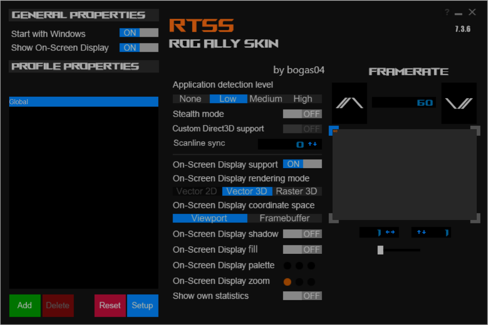

# rtss-rog-ally-skin
A skin for RivaTuner Statistics Server that's more handheld friendly inspired by Rog Ally design language.

* Wide screen UI that allows easy navigation on sub 1080p resolutions.
* BIG FPS UP/DOWN buttons, easy to tap with fingers or mouse using right joystick.
* Rog Font Styling



## Installation

Simply download the [rogally.usf](./dist/rogally.usf) from the `dist` folder of this repository and place it in Skins folder of your RTSS installation. It should usually look something like this:

```bash
C:\Program Files (x86)\RivaTuner Statistics Server\Skins
```

Next, open RTSS, open "Setup", choose "User Interface" tab, and select the following theme from the dropdown

`Rog Ally RivaTunerStatisticsServer skin by bogas04`

## How to contribute

RTSS Skinning is a complex art, but if you have time you can learn it [here](https://www.youtube.com/watch?v=9RUTD9AUptU) (thanks to iwanMods) and raise a Pull Request here.

I am no graphics designer, so you are seeing the result of my MS Paint job.

Note: This skin does not use any password, so you can compile and decompile easily.

```bash
# to de-compile
.\RTSS.exe -ds rogally

# to compile
.\RTSS.exe -cs rogally
```